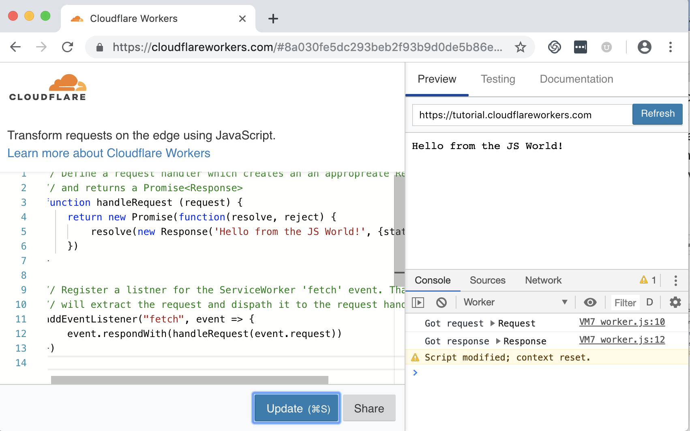
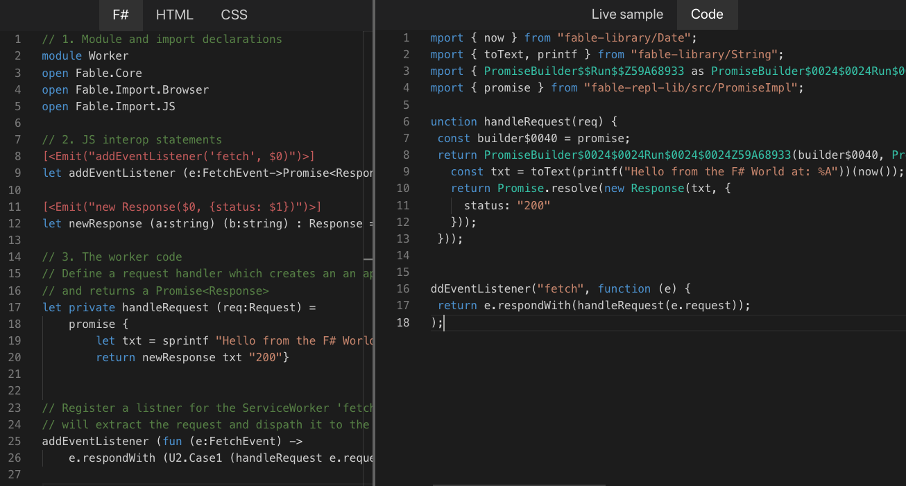
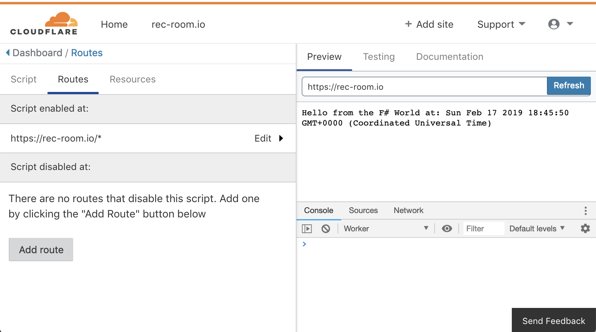
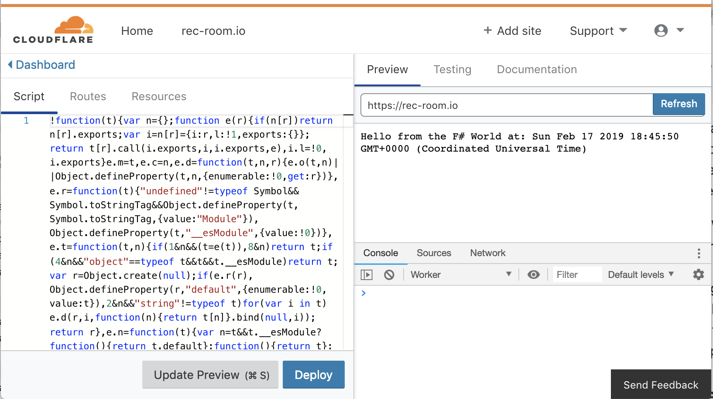

# Cloudflare Workers in FSharp- Part I
FSharp, that hidden gem of a language is on the move. The development of Fable, a FSharp (F#) to JavaScript compiler, has created new opportunities and energized the community. As a result we now have [Elmish](https://elmish.github.io/elmish/) an Elm inspired architecture for browser side UI development, the [SAFE](https://safe-stack.github.io) stack providing a top-to-bottom FSharp solution and, a dedicated conference [FABLE Conf](https://fable.io/fableconf/).  

But browser UI development is not the only opportunity created by FABLE. This is the first of a few posts exploring how to run FSharp in the cloud by compiling it to JavaScript and then hosting it on the Cloudflare Worker infrastructure. This post covers what Cloudflare Workers are, how they look in JavaScript, a "Hello World" worker in F#, basic tooling and, some resources. Additional posts will cover building full [API's](https://github.com/jbeeko/cfworker-web-api) and a real-world use for Workers. 

[**Skip this, take me to the hands on part.**](#tooling-and-workflow)


## Cloudflare Workers
Like Azure Functions or AWS Lambda, Cloudflare workers are "functions as a service". But rather than starting a VM or a container to run functions, workers are run in [Chrome V8 isolates](https://v8.dev/docs/embed) via the [`ServiceWorker`](https://developer.mozilla.org/en-US/docs/Web/API/Service_Worker_API) API. The are written in JavaScript, any language that compiles to JavaScript or any language that compiles to [WASM](https://webassembly.org).

 Because V8 Isolates are much lighter weight than processes this approach results in better machine utilization, faster cold start times, good performance, and a very low cost. Because Cloudflare automatically hosts all workers in all of their 150+ data centers world-wide, round-trip latency is very low and scaling is completely transparent to the developer. In fact there are no scaling related parameters available to developers. [This](https://blog.cloudflare.com/cloud-computing-without-containers/) post is a good introduction to workers.
 
 Workers are not (today) a replacement for other "functions as a service" in all scenarios. Rather they are designed for short running tasks that benefit from wide distribution. The resource limits are setup with that in mind. Cloudflare Workers are limited to:
 - 128MB of memory
 - 5 to 50+ms of CPU time per request depending on the plan. (The free plan is 5ms).
 - 50 sub-requests (aka make an HTTP request) per request. (CF intends to remove this limit).

 These constraints may see unrealistic (on the consumption plan Azure lets functions run for 10 minutes without explicit CPU limits). But it is surprising how much can be done within them. For a fuller discussion [see](https://developers.cloudflare.com/workers/writing-workers/resource-limits/). 


 ## A Worker in JS
A Cloudflare Worker is a [`ServiceWorker`](https://developer.mozilla.org/en-US/docs/Web/API/Service_Worker_API) running in a V8 Isolate hosted at one of the CF data centers. The Cloudflare infrastructure starts the worker on in response to a HTTP request and manages the worker life-cycle. To use them developers simply add a listener for a [FetchEvent](https://developer.mozilla.org/en-US/docs/Web/API/FetchEvent):

`addEventListener("fetch", listener`)

 The listener is typically an anonymous function that takes a FetchEvent extracts the [request](https://developer.mozilla.org/en-US/docs/Web/API/Request) and dispatches the request to a handler which does the work and returns a [`Promise<Response>`](https://developer.mozilla.org/en-US/docs/Web/API/Response). The listener then invokes `respondWith` on the event passing in the response promise. Here is a simple example. 

```
// Define a request handler which creates an an appropreate Response 
// and returns a Promise<Response>
function handleRequest (request) {
    return new Promise(function(resolve, reject) {
        resolve(new Response('Hello from the JS World!', {status: 200}))
    })
}

// Register a listner for the ServiceWorker 'fetch' event. That listner
// will extract the request and dispath it to the request handler.
addEventListener("fetch", event => {
    event.respondWith(handleRequest(event.request))
})
```

If you go to the Cloudflare worker [playground](https://cloudflareworkers.com) and paste that code into the online editor you will have a http handler running in the cloud. That's it you have written and deployed your first Worker. 



For more examples see the [documentation](https://developers.cloudflare.com/workers/recipes/) site.

> NOTE: The example here uses a `Promise` because that makes the relationship between the JavaScript version and what is generated by Fable, the FSharp to JavaScript compiler, obvious. The Cloudflare documentation tends to write request handlers using the new JavaScript `async function` syntax. The two are functionally the same since `async function` returns a promise. Using the async syntax our handler would be written:
```
async function handleRequest (request) {
    return new Response('Hello from the JS World!', {status: 200})
}
```

## Writing the Worker in FSharp
The F# code for the "Hello World" worker is below. It is in three sections. 
1. The module declaration and some `open` (aka `import`) statements.
2. Then some JavaScript interoperability functions. 
3. The F# code which implements the worker.

```
// 1. Module and import declarations
module Worker
open Fable.Core
open Fable.Import.Browser
open Fable.Import.JS

// 2. JS interop statements
[<Emit("addEventListener('fetch', $0)")>]
let addEventListener (e:FetchEvent->Promise<Response>) : unit = jsNative

[<Emit("new Response($0, {status: $1})")>]
let newResponse (a:string) (b:string) : Response = jsNative

// 3. The worker code
// Define a request handler which creates an an appropreate Response 
// and returns a Promise<Response>
let private handleRequest (req:Request) =
    promise {
        let txt = sprintf "Hello from the F# World at: %A" System.DateTime.Now
        return newResponse txt "200"}


// Register a listner for the ServiceWorker 'fetch' event. That listner
// will extract the request and dispath it to the request handler.
addEventListener (fun (e:FetchEvent) ->
    e.respondWith (U2.Case1 (handleRequest e.request)))
```

### Worker Code
The worker code reads almost the same as the JavaScript version. The `handleRequst` function takes a request and then returns a `Response` from a `promise` computation expression. 

The call to `addEventListener` again takes an anonymous function with the event as a parameter, dispatches to the handler getting a response promise and then invokes `respondWith` on the event. A times stamp was added just to show the function is running and not static.

### Interop Code
These two functions provide type checking support to the F# tooling when calling JS functions in external libraries. When compiled these emit the JavaScript specified in the attribute. For example for example `addEventListener` is defined as a F# function that takes one parameter returns `unit` and does nothing. When the F# is compiled the `Emit` attribute will force `addEventListener('fetch', $0)` into the JavaScript where `$0` is replaced the the parameter provided. For more on how to interop with JavaScript see [this](https://medium.com/@zaid.naom/f-interop-with-javascript-in-fable-the-complete-guide-ccc5b896a59f).

In most cases the interop functions are part of a standard FABLE library. For example `open Fable.Import.Browser` brings in a huge number of these. Ideally there would be a library `Fable.Import.CFWorkers`. In that case there would be no need for those lines in the worker code.

### open Statements
Finally at the very top are some `open` (aka `import`) statements which reference the various libraries used. 


## Bundling the Code
The online Fable [REPL](https://fable.io/repl/) can be used to see what JS our worker gets compiled into:



Unfortunately the JavaScript generated by the Fable compiler can't be used as is. This is because workers must have all code in a single file. But the generated JavaScript uses `import` statements to bring in libraries that support the F# language features used. For example the `promise` computation expression builder. 

To create a single file the Fable tool chain uses WebPack which is configured with the `fable-loader`. The loader processes F# files resulting a Babel compliant AST. Babel is then used to generate JavaScript and WebPack bundles it all together.  The webpack.config.js file is:
```
var babelConfig = {
    // More info at https://github.com/babel/babel/blob/master/packages/babel-preset-env/README.md
    presets: [
        ["@babel/preset-env", {
            "modules": false,
            "useBuiltIns": false,
            "loose": true,
            // Use babel-preset-env to generate JS compatible with latest Chrome V8
            "targets": {"chrome": "73"}
    }]]}

module.exports = {
    entry: {worker: ['./Worker.fsproj']},
    target: 'webworker',
    output: {
        path: __dirname,
        filename: '[name].bndl.js',
    },
    mode: "production",
    // See https://github.com/fable-compiler/Fable/issues/1490
    resolve: {symlinks: false},
    module: {
        rules: [
            // - fable-loader: transforms F# into JS
            {
                test: /\.fs(x|proj)?$/,
                use: {
                    loader: "fable-loader",
                    options: {babel: babelConfig}
        }}]
    }
};
```
This file is fairly simple as far as WebPack files go. Key parts are:

`entry: {worker: ['./Worker.fsproj']}`

Which gives WebPack the XML based project file to start from. This passed to the FABLE loader which parses it extracting the files to compile and the compile order. 

And presets for Babel:
```
presets: [
    ["@babel/preset-env", {
        "modules": false,
        "useBuiltIns": false,
        "loose": true,
        // Use babel-preset-env to generate JS compatible with latest Chrome V8
        "targets": {"chrome": "73"}
}]]
```
For Workers we can target the most recent version of Chrome. The bundled output is [here](worker.bndl.js).


## Deploying Manually
To deploy a worker outside the Cloudflare playground you will need to sign up for an account and add your domain to it, the free account is fine. However since Workers are billed by usage you will need to provide a card to enable them. The minimum charge of $5.00/month includes the first ten million worker invocations. Further invocations are charged at $0.50 per million.

Assuming you have added a domain to Cloudflare and now want to add a worker go to your domain and click on the Workers tile. This opens the Workers page, Launch the Editor. This brings you to the Worker editor. There are two steps to deploy your worker. First create a route on which your worker will be active. To make the script active on all routes enter `https://your-domain.com/*`



Then go to the scripts tab and paste in the bundled javascript and click deploy. You will see the worker running in the editor.



Then if you visit your site, for example [https://rec-room.io](https://rec-room.io) you will again see the output. 


## Scaling and Performance
This is by no means rigorous, but  using Apache Bench it is possible to get an idea of how well Workers perform and scale. 

From a home network the command `ab -k -n 1000000 -c 100 https://rec-room.io/hello/` showed 2500 requests per second. Running the same command from network with a better connection resulted in about 5000/requests per second with an average response time of 17ms.  
```
$ ab -k -n 1000000 -c 100 https://rec-room.io/hello/
This is ApacheBench, Version 2.3 <$Revision: 1826891 $>
Copyright 1996 Adam Twiss, Zeus Technology Ltd, http://www.zeustech.net/
Licensed to The Apache Software Foundation, http://www.apache.org/

Benchmarking rec-room.io (be patient)
...
Finished 1000000 requests


Server Software:        cloudflare
Server Hostname:        rec-room.io
Server Port:            443
SSL/TLS Protocol:       TLSv1.2,ECDHE-ECDSA-CHACHA20-POLY1305,256,256
TLS Server Name:        rec-room.io

Document Path:          /hello/
Document Length:        90 bytes

Concurrency Level:      100
Time taken for tests:   171.028 seconds
Complete requests:      1000000
Failed requests:        0
Keep-Alive requests:    999052
Total transferred:      521995260 bytes
HTML transferred:       90000000 bytes
Requests per second:    5846.99 [#/sec] (mean)
Time per request:       17.103 [ms] (mean)
Time per request:       0.171 [ms] (mean, across all concurrent requests)
Transfer rate:          2980.57 [Kbytes/sec] received

Connection Times (ms)
              min  mean[+/-sd] median   max
Connect:        0    0   7.7      0     915
Processing:     8   17  10.5     15     871
Waiting:        8   17  10.5     15     871
Total:          8   17  13.7     15     960

Percentage of the requests served within a certain time (ms)
  50%     15
  ...
  99%     43
 100%    960 (longest request)
$ 
```

Responses show requests are being handed by the data center `SEA`. Distributing requests globally will result in many times this throughput. All without giving any thought to scaling.

>NOTE: Rate limiting is enabled across `rec-room.io`. If you wish to explore performance you will need to sign up for an account as described [above](#deploying-manually).

The [Cloudflare Workers blog](https://blog.cloudflare.com/tag/workers/) has a series of posts benchmarking workers against other providers. These look at [latency, cold-start times](https://blog.cloudflare.com/serverless-performance-comparison-workers-lambda/) and [CPU performance](https://blog.cloudflare.com/serverless-performance-with-cpu-bound-tasks/). 


## Tooling and Workflow
The repository https://github.com/jbeeko/cfworker-hello-world will let you replicate the Hello World worker change it and build a modified version. 

### Prerequisites
This repository was developed under OSX. But you should be able to use Windows, OSX or Linux. The following tooling is assume to be installed before you clone the repository:
* dotnetcore 2.1 - [see](https://dotnet.microsoft.com/download/dotnet-core/2.1)
* FSharp - [see](https://fsharp.org/guides/mac-linux-cross-platform/). Note on OSX/Linux you will also need Mono- [see](https://www.mono-project.com/download/stable/#download-mac) or via Homebrew.
* An FSharp editor - I recommend [VSCode](https://code.visualstudio.com/download) with the [Ionide](https://marketplace.visualstudio.com/items?itemName=Ionide.Ionide-fsharp) extension. But MS VisualStudio, JetBrains Rider or a number of others should work.
* Node and Node Package Manager - [see](https://nodejs.org/en/download/) or via Homebrew
* Yarn - [see](https://www.npmjs.com/package/yarn) or via Homebrew
* cloudworker - [see](https://github.com/dollarshaveclub/cloudworker). Install it globally with `npm -g install @dollarshaveclub/cloudworker`. 

### Building and Running
Clone the repository https://github.com/jbeeko/cfworker-hello-world.

Then you can install dependancies and node modules with:
```
$ yarn install
yarn install v1.13.0
[1/4] 🔍  Resolving packages...
[2/4] 🚚  Fetching packages...
[3/4] 🔗  Linking dependencies...
[4/4] 🔨  Building fresh packages...
✨  Done in 3.17s.
```
You can test that the local cloudworker host is installed correctly with:
```
$ cloudworker Worker.js
Starting up...
Listening on 3000
```
You can then visit `http://localhost:3000` and get back `Hello from the JS World!`. Stop the local cloudworker and then start the cloudworker watching the worker bundled file (via the `-r`) flag.
```
$ cloudworker -r  Worker.bndl.js
Starting up...
Listening on 3000
```
Worker.bndl.js is the JS generated from the F# and visiting local host will show: `Hello from the F# World at: Sun Feb 17 2019 16:09:37 GMT-0800 (Pacific Standard Time)`.

Edit Worker.fs changing the hello world message. 
```
...
        let txt = sprintf "Hello from My World at: %A" System.DateTime.Now
...
```

Save the file and then in a new terminal:
```
$ yarn webpack
yarn run v1.13.0
$ /Users/jbeeko/cfworker-hello-world/node_modules/.bin/webpack
fable-compiler 2.1.12
...
bunch of build messages suppresed here
...
✨  Done in 13.75s.
```

And in the first terminal window you will see the local worker has detected the new `Worker.bndl.js` file and reloaded:
```
Changes to the worker script detected - reloading...
Successfully reloaded!
```

Refreshing your browser will show the new message. If you have a Cloudflare account you can copy the content of the `worker.bndl.js` file and deploy it to the cloud.


## Summary
This installment started by covering what Cloudflare Workers are, how to run one in the playground, how to write one in F# and how to deploy a worker to your domain manually. After that we looked at some performance characteristics of the deployed worker. Finally we reviewed the tools need to develop them locally using a local runtime supporting automatic reloading of the server. The next [installment](https://github.com/jbeeko/cfworker-web-api) looks at automated worker deployment, persistence and routing to support a multi-endpoint web API. 


## Resources

### Workers
* Introduction - [https://blog.cloudflare.com/cloud-computing-without-containers/](https://blog.cloudflare.com/cloud-computing-without-containers/)
* Docs - [https://developers.cloudflare.com/workers/about/](https://developers.cloudflare.com/workers/about/)
* Performance discussion - [https://blog.cloudflare.com/serverless-performance-with-cpu-bound-tasks/](https://blog.cloudflare.com/serverless-performance-with-cpu-bound-tasks/)

### Fable
* Main fable site - [https://fable.io](https://fable.io)
* Fable REPLE - [https://fable.io/repl/](https://fable.io/repl/)
* JS Interoperation - [https://medium.com/@zaid.naom/f-interop-with-javascript-in-fable-the-complete-guide-ccc5b896a59f](https://medium.com/@zaid.naom/f-interop-with-javascript-in-fable-the-complete-guide-ccc5b896a59f)

